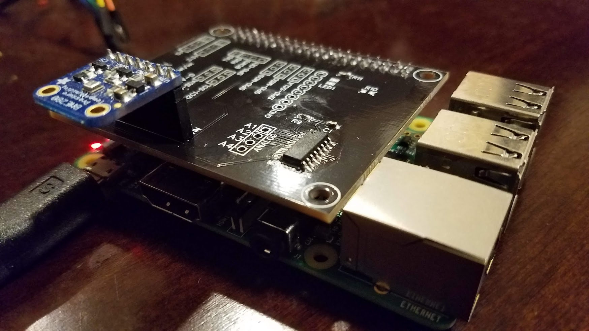
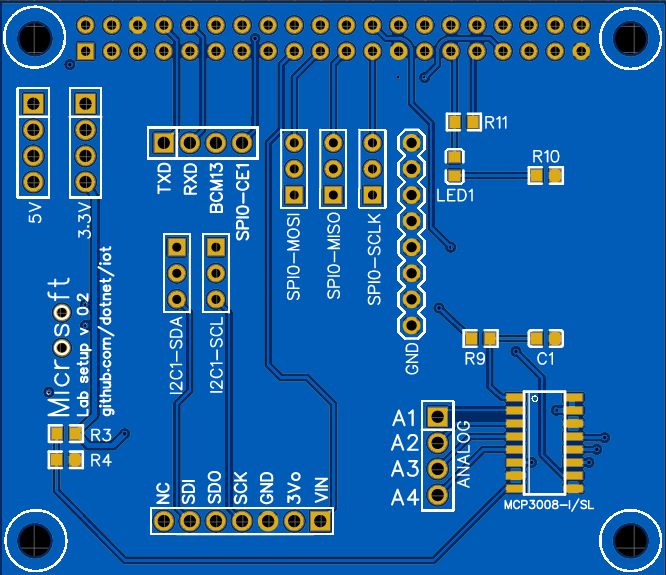

# How to run the tests

This shows how to run the tests on a Raspberry Pi. On other platforms, things should be similar.

## Building on the desktop PC

(to be extended)

## Building directly on the Pi

First, clone the repository on the pi:

```shell
git clone https://github.com/dotnet/iot
cd iot
```

Now you can

- Either download and install the NET Core SDK from <https://get.dot.net/> (the Raspberry Pi with the default 32 Bit Raspbian Linux requires the ARM32 version) or
- run `./build.sh` in the checkout directory. This will install the correct NET Core SDK in the .dotnet subfolder of the working copy.

Build System.Device.Gpio.dll:

```shell
cd src/System.Device.Gpio
dotnet build System.Device.Gpio.sln
```

This builds the main System.Device.Gpio assembly together with its test assembly. Before running the tests, you need to:

- Connect BCM Pins 12 and 16 (physical Pins 32 and 36) with a cable. It is suggested to add a 1kΩ to 10kΩ resistor between the pins; this protects the Pi in the case of a misconfiguration (i.e both pins set to Out, one high, the other low).
- Leave BCM Pin 23 (physical Pin 16) open (not connected to anything).

## Raspberry Pi driver tests

After that, you can run the tests with the RaspberryPiDriver (which is the default low-level driver for the Raspberry Pi) like:

```shell
dotnet test --filter RaspberryPiDriverTests System.Device.Gpio.sln 
```

Depending on the version of the Pi and the installed Linux distribution, it may be required to run the tests as root:

```shell
sudo dotnet test --filter RaspberryPiDriverTests System.Device.Gpio.sln 
```

If everything went smoothly, the output should end with a success message.

Alternatively, you can run the tests using the xunit console runner, which allows for better control of what should be executed (see the next section).

XUnit.console.runner is installed as a nuget package on the system in your home directory during the build. From the root of the project directory, execute:

```shell
pi@raspberrypi:~/projects/iot $ dotnet exec ~/.nuget/packages/xunit.runner.console/2.4.1/tools/netcoreapp2.0/xunit.console.dll artifacts/bin/System.Device.Gpio.Tests/Debug/netcoreapp3.1/System.Device.Gpio.Tests.dll -notrait "SkipOnTestRun=Windows_NT" -notrait "feature=i2c"
```

This runs the tests excluding the I2C tests (-notrait "feature-i2c") and excluding the Windows tests (-notrait "SkipOnTestRun=Windows_NT").

## Running tests depending on components/requirements

Currently the full test suite requires following components, if you don't have one use following command line switches to skip (for the full command line, see above)

| Requirements | Skip arguments |
| --- | --- |
| MCP 3008 (SPI)* | `-notrait feature=spi` |
| BME280 (I2C) | `-notrait feature=i2c` |
| Pins 5 and 6 connected | `-notrait feature=gpio` |
| libgpiod | `-notrait feature=gpio-libgpiod` |
| sysfs access (i.e. sudo or permissions) | `-notrait feature=gpio-sysfs` |
| configured PWM (overlaps with MCP3008 setting) | `-notrait feature=pwm` |
| root access (overlaps, assumes you use default permissions) | `-notrait requirement=root` |

- Also inputs to ADC are required including one connected to PWM output through low pass filter, please refer to the schematics.

## SysFsDriver Tests

You can also run the SysFsDriver Tests (this uses a more generic approach). This driver requires root permissions to run, so you need to `sudo` the command:

```shell
sudo dotnet test --filter SysFsDriverTests System.Device.Gpio.sln 
```

## LibgpiodDriver Tests

To run the Libgpiod Driver test (a Linux Kernel Driver for the GPIO device), you need to first install the libgpiod package:

```shell
sudo apt install -y libgpiod-dev
```

These tests do not require root permissions to run:

```shell
dotnet test --filter LibGpiodDriverTests System.Device.Gpio.sln 
```

## Full test run schematics

Our CI is currently using [this schematics](schematics/board-schematics.pdf) with Raspberry PI 3.

You can download [gerber files](schematics/board-gerber.zip) if you'd like to manufacture PCB yourself (this is a 2 layer board).

Following list of components are needed for PCB:

| Component | Quantity |
| --- | --- |
| MCP3008 I/SL | 1 |
| BME280 breakout board | 1 |
| 2x20 female header (Raspberry PI hat) | 1 |
| 1x7 female header (for BME280 breakout board) | 1 |
| 4.7k resistor in 0603 (US) package | 4 |
| 0.1u (100n) capacitor in 0603 (US) package | 1 |
| (optional) 1x3 male header | 5 |
| (optional) 1x4 male header | 4 |
| (optional) 1x8 male header | 1 |
| (optional) 200 ohm resistor in 0603 (US) package | 1 |
| (optional) LED in 0603 (US) package | 1 |

All headers are standard 2.54mm headers. Male headers are usually sold longer and are breakable to size.




## Raspberry Pi configuration

### Linux

`/boot/config.txt`

```text
# Enable I2C, SPI, PWM

dtparam=i2c_arm=on
dtparam=spi=on
dtoverlay=pwm-2chan
```
