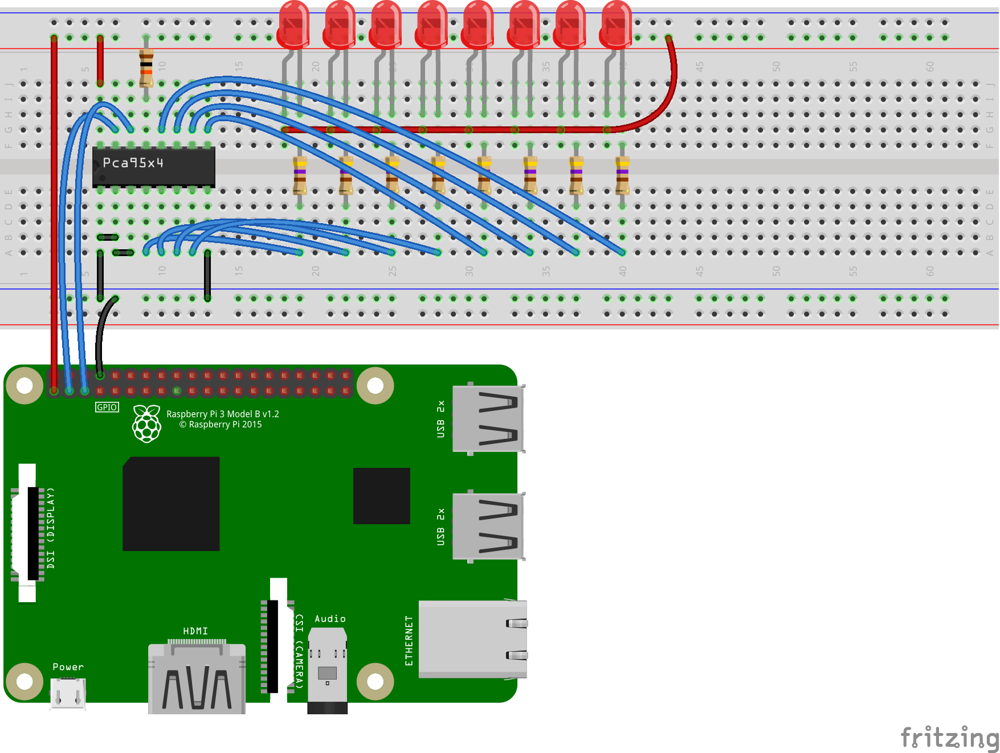

# Pca95x4 - I2C GPIO Expander

The PCA95x4 provides 8 bits of General Purpose parallel Input/Output (GPIO) expansion for I2C-bus applications.

## Documentation

- Philips I2C IO expanders application notes can be found [here](http://ecee.colorado.edu/~mcclurel/Philips_I2C_IO_Expanders_AN469_2.pdf)

### NXP

- PCA9534 [datasheet](https://www.nxp.com/docs/en/data-sheet/PCA9534.pdf)
- PCA9534A [datasheet](https://www.nxp.com/docs/en/data-sheet/PCA9534.pdf)
- PCA9554/PCA9554A [datasheet](https://www.nxp.com/docs/en/data-sheet/PCA9554_9554A.pdf)

### Texas Instruments

- PCA9534 [datasheet](http://www.ti.com/lit/ds/symlink/pca9534.pdf)
- PCA9534A [datasheet](http://www.ti.com/lit/ds/symlink/pca9534a.pdf)
- PCA9554 [datasheet](http://www.ti.com/lit/ds/symlink/pca9554.pdf)
- PCA9554A [datasheet](http://www.ti.com/lit/ds/symlink/pca9554a.pdf)

## Board



## Usage

This example shows how to write value out to 8 LEDs using a PCA95x4 device and a RPi3.

```csharp
I2cConnectionSettings i2cConnectionSettings = new(1, 0x38);
I2cDevice i2cDevice = I2cDevice.Create(i2cConnectionSettings);
pca95x4 = new Pca95x4(i2cDevice);
```

### Cycle output bits

```csharp
pca95x4.Write(Register.Configuration, 0x00);  // Make all outputs.
pca95x4.Write(Register.OutputPort, 0xFF);  // Set all outputs.

for (int bitNumber = 0; bitNumber < 8; bitNumber++)
{
    pca95x4.WriteBit(Register.OutputPort, bitNumber, false);  // Clear output.
    Thread.Sleep(500);
    pca95x4.WriteBit(Register.OutputPort, bitNumber, true);  // Set output.
}
```

### Read Input Port

```csharp
pca95x4.Write(Register.Configuration, 0xFF);  // Make all inputs.
byte data = pca95x4.Read(Register.InputPort);
Console.WriteLine($"Input Port: 0x{data:X2}");
```

### Check Input Register Polarity Inversion

```csharp
pca95x4.Write(Register.Configuration, 0xFF);  // Make all inputs.
byte data = pca95x4.Read(Register.InputPort);
Console.WriteLine($"Input Register: 0x{data:X2}");
pca95x4.InvertInputRegisterPolarity(true);
data = pca95x4.Read(Register.InputPort);
Console.WriteLine($"Input Register Polarity Inverted: 0x{data:X2}");
pca95x4.InvertInputRegisterPolarity(false);
data = pca95x4.Read(Register.InputPort);
Console.WriteLine($"Input Register: 0x{data:X2}");
```

## Binding Notes

PCA9534/PCA9554 and PCA9534A/PCA9554A are identical except for a few differences.

- The removal of the internal I/O pull-up resistor which greatly reduces power consumption when the I/Os are held LOW.
- Each has a fixed I2C address. This allows for up to 16 of these devices (8 of each) on the same I2C bus.
