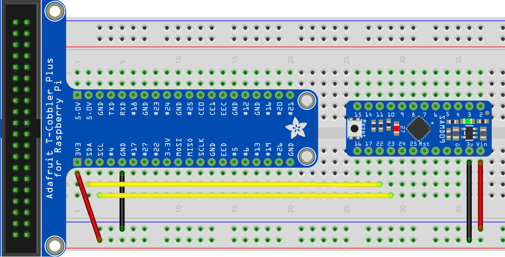
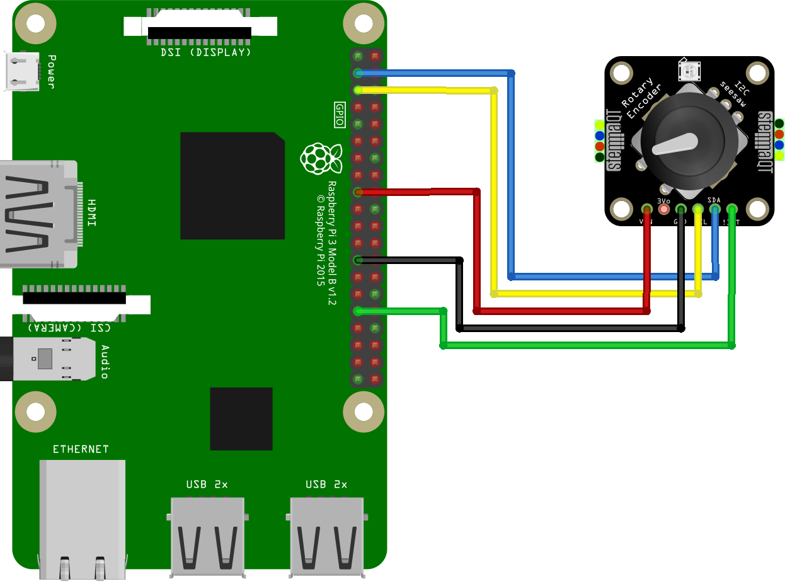

# Adafruit Seesaw - extension board (ADC, PWM, GPIO expander)

Adafruit Seesaw is a near-universal converter framework which allows you to add and extend hardware support to any I2C-capable microcontroller or microcomputer. Instead of getting separate I2C GPIO expanders, ADCs, PWM drivers, etc, seesaw can be configured to give a wide range of capabilities.

This binding provides an Api which is close to the one provided by Adafruit themselves but also implements IGpioController so that available Gpio pins can be used in place of any 'on board' ones but using the standard IoT API.

This binding was developed using the Adafruit Seesaw breakout board which uses the ATSAMD09 and the default firmware exposes the following capabilities:

* 3 x 12-bit ADC inputs
* 3 x 8-bit PWM outputs
* 7 x GPIO with selectable pullup or pulldown
* 1 x NeoPixel output (up to 340 pixels)
* 1 x EEPROM with 64 byte of NVM memory (handy for storing small access tokens or MAC addresses)
* 1 x Interrupt output that can be triggered by any of the accessories

## Documentation

* <https://cdn-learn.adafruit.com/downloads/pdf/adafruit-seesaw-atsamd09-breakout.pdf?timestamp=1564230162>

## Usage

These samples connect to a Raspberry Pi via the first I2C interface. Issues were noticed when using the out-of-the-box stiings and so the I2C bus has been slowed down by adding the following to the /boot/Config.txt file

 `dtparam=i2c1_baudrate=50000`

### Connecting to a Seesaw breakout board via I2C

This sample simply connects to an Adafruit Seesaw breakout board, reads and then displays the capabilities of the board firmware

```csharp
    const byte Adafruit_Seesaw_SoilSensor_I2cAddress = 0x36;
    const byte Adafruit_Seesaw_SoilSensor_I2cBus = 0x1;

    using (I2cDevice i2cDevice = I2cDevice.Create(new I2cConnectionSettings(Adafruit_Seesaw_SoilSensor_I2cBus, Adafruit_Seesaw_SoilSensor_I2cAddress)))
    using(Seesaw ssDevice = new Seesaw(i2cDevice))
    {
        while(true)
        {
            Console.WriteLine($"Temperature: {ssDevice.GetTemperature()}'C");
            Console.WriteLine($"Capacitive: {ssDevice.TouchRead(0)}");
            ssDevice.SetGpioPinMode(1, PinMode.Output);
            System.Threading.Tasks.Task.Delay(1000).Wait();
        }
    }
```



### Connecting to a Seesaw based soil mositure sensor

This sample connects a Raspberry Pi to an Adafruit capacitive soil sensor

```csharp
const byte Adafruit_Seesaw_Breakout_I2cAddress = 0x49;
const byte Adafruit_Seesaw_Breakout_I2cBus = 0x1;

using (I2cDevice i2cDevice = I2cDevice.Create(new I2cConnectionSettings(Adafruit_Seesaw_Breakout_I2cBus, Adafruit_Seesaw_Breakout_I2cAddress)))
using (Seesaw ssDevice = new Seesaw(i2cDevice))
{
    Console.WriteLine();
    Console.WriteLine($"Seesaw Version: {ssDevice.Version}");
    Console.WriteLine();
    foreach (Seesaw.Seesaw_Module module in Enum.GetValues(typeof(Seesaw.Seesaw_Module)))
    {
        Console.WriteLine($"Module: {Enum.GetName(typeof(Seesaw.Seesaw_Module), module)} - {(ssDevice.HasModule(module) ? "available" : "not-available")}");
    }
    Console.WriteLine();
}
```


### Blinking Lights sample

This sample duplicates the functionality of the rpi-more-blinking-lights sample but instead of using the raspberry pi Gpio it uses the Seesaw breakout board for all inputs


### Connecting to a Seesaw based rotary encoder sample

This sample connects a Raspberry Pi to an Adafruit I2C QT Rotary Encoder



## Binding Notes

When using Seesaw devices with a Raspberry Pi it has been observed that errors sometimes happen on the I2C bus. The nature of this error may be the 'clock stretching' [bug](http://www.advamation.com/knowhow/raspberrypi/rpi-i2c-bug.html) or may just be that the breakout board cannot accommodate the default I2C speed.

It has been found that the Raspberry Pi 4 works correctly with this binding when the I2C bus is slowed using the following command in the Config.txt file.

`dtparam=i2c1_baudrate=50000`

In general the Seesaw technology allows user the embedding of the following types of modules into firmware and the modules ticked are the ones that have been covered by this binding.

* [X] Status - providing overall feedback on the availability of modules and control of the expander
* [X] Gpio
* [ ] Serial Communications
* [ ] Timers
* [X] Analog Input
* [ ] Analog Output
* [ ] DAP
* [X] EEPROM (although untested)
* [X] Capacitive Touch
* [ ] Keypad
* [X] Rotary Encoder
